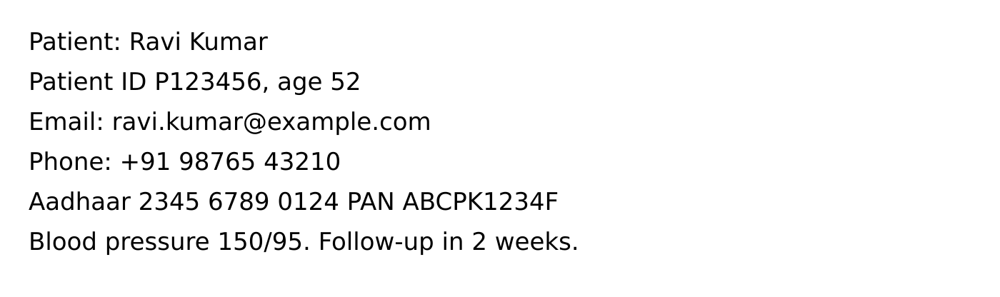
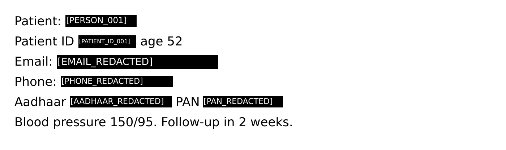

# 4. Images

Demo: [`demos/03-image.ts`](../../demos/03-image.ts)

```bash
npm install sharp tesseract.js @tesseract.js-data/eng   # once
node demos/03-image.ts                # uses a synthetic screenshot
node demos/03-image.ts ./my-scan.jpg  # or your own image
```

- [4.1 How image protection works](#41-how-image-protection-works)
- [4.2 Step by step](#42-step-by-step)
- [4.3 Before and after](#43-before-and-after)
- [4.4 Sending a protected image to an AI](#44-sending-a-protected-image-to-an-ai)
- [4.5 Faces](#45-faces)
- [4.6 Using a different OCR engine](#46-using-a-different-ocr-engine)
- [4.7 OCR quality and when results are "uncertain"](#47-ocr-quality-and-when-results-are-uncertain)
- [4.8 Supported formats, limits and performance](#48-supported-formats-limits-and-performance)
- [4.9 Recipes](#49-recipes)

---

## 4.1 How image protection works

```text
image bytes
  → check the real format (magic bytes), size and dimensions
  → apply EXIF rotation, re-encode to PNG (this drops EXIF/GPS/camera metadata)
  → local OCR (Tesseract in worker threads) → words with positions
  → detect sensitive values in the OCR text → apply policy
  → paint an opaque box over every word that belongs to a protected value
     (with the token, e.g. [PERSON_001], written inside when it fits)
  → redacted PNG + sanitized text
```

Nothing is uploaded anywhere. OCR runs on your machine.

## 4.2 Step by step

### Step 1: install the image features

```bash
npm install sharp tesseract.js @tesseract.js-data/eng
npx aran doctor       # Images ✓  OCR ✓
```

### Step 2: protect the image

```ts
import { readFile, writeFile } from "node:fs/promises";
import { Aran } from "aiaran";

const aran = new Aran({ policy: "healthcare" });

const result = await aran.protect({
  type: "image",
  data: await readFile("screenshot.png"),
  filename: "screenshot.png", // optional, checked against the real format
  mimeType: "image/png", // optional, checked too
});
```

### Step 3: check the status

```ts
console.log(result.status); // "safe" | "uncertain" | "blocked"
console.log(result.warnings); // e.g. FACES_NOT_INSPECTED (info)
```

### Step 4: use the outputs

```ts
if (result.safeData) {
  await writeFile("screenshot.redacted.png", result.safeData.image); // redacted PNG
  console.log(result.safeData.text); // sanitized OCR text
}
```

### Step 5: shut down OCR when your script ends

```ts
await aran.dispose();
```

### Demo output

```text
status: safe   (556 ms, includes starting the OCR worker)
ID    TYPE                    CONF   WHERE              ACTION        REPLACEMENT
E1    PERSON                  0.85   chars 9-19         tokenize      [PERSON_001]
E2    PATIENT_ID              0.85   chars 31-38        tokenize      [PATIENT_ID_001]
E3    AGE                     0.85   chars 44-46        allow
E4    EMAIL                   0.95   chars 54-76        redact        [EMAIL_REDACTED]
E5    PHONE                   0.90   chars 84-99        redact        [PHONE_REDACTED]
E6    AADHAAR                 0.98   chars 108-122      redact        [AADHAAR_REDACTED]
E7    PAN                     0.95   chars 127-137      redact        [PAN_REDACTED]
Warnings:
  [info] FACES_NOT_INSPECTED: No face detector is configured; faces in images were not inspected.
```

Every image entity has a **bounding box**, giving the pixel area that was painted over:

```ts
for (const e of result.detectedEntities) console.log(e.type, e.boundingBox);
```

```text
PERSON       x=182 y=42 w=195 h=31
PATIENT_ID   x=218 y=99 w=158 h=33
AGE          x=463 y=99 w=41 h=30
EMAIL        x=158 y=154 w=445 h=37
PHONE        x=169 y=211 w=308 h=30
AADHAAR      x=194 y=267 w=281 h=30
PAN          x=562 y=267 w=220 h=30
```

`AGE` has a box but is **not** painted over, because the `healthcare` policy allows it. Only entities whose action is not `allow` are covered.

The sanitized OCR text:

```text
Patient: [PERSON_001]
Patient ID [PATIENT_ID_001], age 52
Email: [EMAIL_REDACTED]
Phone: [PHONE_REDACTED]
Aadhaar [AADHAAR_REDACTED] PAN [PAN_REDACTED]
Blood pressure 150/95. Follow-up in 2 weeks.
```

## 4.3 Before and after

| Before (synthetic sample)          | After `protect()`                |
| ---------------------------------- | -------------------------------- |
|  |  |

The demo then OCRs the **redacted** image a second time to verify that nothing sensitive is still readable:

```text
--- 4. Second OCR pass over the redacted image (verification) ---
entities still readable: []
```

You can do the same in your app for high-risk images:

```ts
const check = await aran.scan({ type: "image", data: result.safeData!.image });
if (check.detectedEntities.some((e) => e.type !== "AGE")) throw new Error("Redaction incomplete");
```

## 4.4 Sending a protected image to an AI

With `generate()`, ARAN sends the redacted image plus the sanitized text:

```ts
import { OpenAIProvider } from "aiaran";

const { text } = await aran.generate(
  new OpenAIProvider({ model: "gpt-4o-mini" }),
  { type: "image", data: await readFile("screenshot.png") },
  { system: "Describe what this form is about." },
);
```

The request contains `[{ type: "image", data: <redacted PNG base64>, mimeType: "image/png" }, { type: "text", text: "Text visible in the image (sanitized): …" }]`. Every provider adapter converts this to its own format.

If you call the model yourself, send `result.safeData.image` (base64-encode it if your SDK needs that) and never the original file.

## 4.5 Faces

ARAN doesn't include a face-detection model. Without one, each image result has the notice:

```text
[info] FACES_NOT_INSPECTED: No face detector is configured; faces in images were not inspected.
```

To redact faces, plug in any local face detector that returns boxes:

```ts
import { Aran, type FaceDetector } from "aiaran";

const faceDetector: FaceDetector = {
  name: "my-face-model",
  version: "1.0.0",
  async detect(png: Buffer) {
    const faces = await myLocalFaceModel(png); // e.g. an ONNX/TensorFlow model
    return faces.map((f) => ({
      box: { x: f.x, y: f.y, width: f.w, height: f.h },
      confidence: f.score,
    }));
  },
};

const aran = new Aran({ faceDetector });
```

Detected faces appear as `FACE` entities and are painted over (unless your policy says `FACE: allow`). The same detector is used for scanned PDF pages and images inside DOCX files.

## 4.6 Using a different OCR engine

Any object with an `extract()` method can replace Tesseract, for example a GPU OCR service running inside your own network:

```ts
import { Aran, type OcrEngine } from "aiaran";

const myOcr: OcrEngine = {
  name: "my-ocr",
  version: "1.0.0",
  async extract(png: Buffer) {
    const result = await myOcrClient.read(png); // must stay inside your infrastructure
    return {
      confidence: result.meanConfidence, // 0–100
      words: result.words.map((w) => ({
        text: w.text,
        confidence: w.confidence, // 0–100
        bbox: { x: w.left, y: w.top, width: w.width, height: w.height },
        line: w.lineIndex, // words with the same line index form one line
      })),
    };
  },
  async dispose() {},
};

const aran = new Aran({ ocr: myOcr });
```

## 4.7 OCR quality and when results are "uncertain"

| Situation                                                      | What ARAN does                                                                    |
| -------------------------------------------------------------- | --------------------------------------------------------------------------------- |
| OCR packages not installed                                     | `OCR_UNAVAILABLE` warning → `uncertain`                                           |
| `ocr: false`                                                   | `OCR_UNAVAILABLE` → `uncertain`                                                   |
| OCR crashes or times out (`limits.ocrTimeoutMs`, default 60 s) | `OCR_FAILED` → `uncertain`                                                        |
| Average OCR confidence below 60 %                              | `OCR_LOW_CONFIDENCE` warning                                                      |
| Average OCR confidence below 40 %                              | `OCR_LOW_CONFIDENCE` (error) → `uncertain`                                        |
| Multi-page TIFF or animated image                              | only the first frame is inspected; `DOCUMENT_STRUCTURE_UNSUPPORTED` → `uncertain` |

Under a **fail-closed** policy (`strict`, `healthcare`, `financial`, `enterprise`), `uncertain` means `safeData` is `null`. Under fail-open, you get the image with whatever could be redacted, plus the warnings.

Tips for better OCR:

- Use the original screenshot rather than a photo of a screen.
- Text should be at least ~20 px tall. Upscale small images before protecting them.
- Install the right language data for non-English text ([chapter 1.5](01-installation-and-setup.md#15-ocr-languages)).
- Handwriting is not reliably recognised.

## 4.8 Supported formats, limits and performance

|                  |                                                                                                       |
| ---------------- | ----------------------------------------------------------------------------------------------------- |
| Formats          | PNG, JPEG, WebP, TIFF (first page). GIF, BMP, SVG and HEIC are rejected.                              |
| Output           | always PNG, with no metadata                                                                          |
| Max file size    | 50 MB (`limits.maxFileBytes`)                                                                         |
| Max width/height | 16,384 px (`limits.maxImageDimension`)                                                                |
| Max pixels       | 40 megapixels (`limits.maxImagePixels`)                                                               |
| OCR timeout      | 60 s per image (`limits.ocrTimeoutMs`)                                                                |
| Speed            | ~0.5–1 s for a 1080p screenshot once the OCR worker is running; the first call also starts the worker |

To process many images in parallel:

```ts
const aran = new Aran({ ocr: { workers: 4 }, concurrency: 4 });
const results = await Promise.all(files.map((data) => aran.protect({ type: "image", data })));
```

## 4.9 Recipes

**Reject uploads that contain sensitive data instead of redacting them:**

```ts
const scan = await aran.scan({ type: "image", data: upload });
if (scan.status === "incomplete") return reply(422, "Could not read this image");
if (scan.summary.riskLevel === "HIGH" || scan.summary.riskLevel === "CRITICAL") {
  return reply(422, `Image contains: ${Object.keys(scan.summary.counts).join(", ")}`);
}
```

**Redact everything found, with no tokens:**

```ts
const aran = new Aran({
  policy: { name: "redact-all", defaultAction: "redact", entities: { AGE: "allow" } },
});
```

`defaultAction` applies only to types without their own rule, and a definition inherits all the `default` policy's rules. To force redaction for specific types, list them: `entities: { PERSON: "redact", EMAIL: "redact", ... }`.

**Strip metadata only (no OCR):**

```ts
const r = await new Aran({ ocr: false, failMode: "open" }).protect({ type: "image", data });
// r.safeData.image is a clean PNG without EXIF/GPS; r.status is "uncertain" because the text was not inspected
```

---

← [3. Text and JSON](03-text-and-json.md) · Next: [5. PDF →](05-pdf.md)
