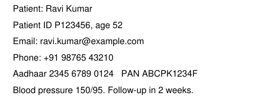
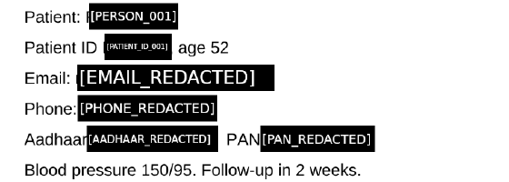

# 5. PDF

Demo: [`demos/04-pdf.ts`](../../demos/04-pdf.ts)

```bash
npm install pdfjs-dist pdf-lib tesseract.js @tesseract.js-data/eng   # once
node demos/04-pdf.ts               # synthetic text PDF + scanned PDF
node demos/04-pdf.ts ./report.pdf  # your own PDF
```

- [5.1 Two kinds of PDF, two modes](#51-two-kinds-of-pdf-two-modes)
- [5.2 Content mode: step by step](#52-content-mode-step-by-step)
- [5.3 Document mode: a sanitized PDF file](#53-document-mode-a-sanitized-pdf-file)
- [5.4 Scanned PDFs](#54-scanned-pdfs)
- [5.5 PDFs with pictures inside](#55-pdfs-with-pictures-inside)
- [5.6 PDF options](#56-pdf-options)
- [5.7 When a PDF is "uncertain"](#57-when-a-pdf-is-uncertain)
- [5.8 Sending a PDF to an AI](#58-sending-a-pdf-to-an-ai)
- [5.9 Limits, performance and what is not supported](#59-limits-performance-and-what-is-not-supported)

---

## 5.1 Two kinds of PDF, two modes

**Kinds of PDF:**

| Kind        | Example                                                        | How ARAN reads it                       |
| ----------- | -------------------------------------------------------------- | --------------------------------------- |
| Text PDF    | exported from Word, generated by software                      | the PDF's text layer (fast, exact)      |
| Scanned PDF | from a scanner or phone, pages are pictures                    | renders each page, then OCR (slower)    |
| Mixed       | text plus embedded images (logos, stamps, scanned attachments) | text layer, plus OCR of the image areas |

ARAN detects which kind each **page** is and handles it automatically.

**Modes:**

| Mode                  | You get                                          | Use it when                                      |
| --------------------- | ------------------------------------------------ | ------------------------------------------------ |
| `"content"` (default) | sanitized **text**, per page                     | you send the PDF's content to an AI (most cases) |
| `"document"`          | sanitized text **plus a new sanitized PDF file** | you need a safe PDF to store, share or attach    |

## 5.2 Content mode: step by step

### Step 1: install

```bash
npm install pdfjs-dist             # text PDFs
npm install tesseract.js @tesseract.js-data/eng   # also needed for scanned pages
npx aran doctor
```

### Step 2: protect

```ts
import { readFile } from "node:fs/promises";
import { Aran } from "aiaran";

const aran = new Aran({ policy: "healthcare" });
const result = await aran.protect({
  type: "pdf",
  data: await readFile("report.pdf"),
  // mode: "content" is the default
});
```

### Step 3: check the result and read the pages

```ts
console.log(result.status, result.metadata.pages);
for (const page of result.safeData?.pages ?? []) {
  console.log(`page ${page.page} (from ${page.source})`); // source: "text" or "ocr"
  console.log(page.text);
}
console.log(result.safeData?.text); // all pages joined with blank lines
```

### Demo output (a 2-page text PDF)

```text
status: safe | pages: 2
ID    TYPE                    CONF   WHERE              ACTION        REPLACEMENT
E1    PERSON                  0.85   page 1             tokenize      [PERSON_001]
E2    PATIENT_ID              0.85   page 1             tokenize      [PATIENT_ID_001]
E3    AGE                     0.85   page 1             allow
E4    EMAIL                   0.95   page 1             redact        [EMAIL_REDACTED]
E5    PHONE                   0.90   page 1             redact        [PHONE_REDACTED]
E6    AADHAAR                 0.98   page 1             redact        [AADHAAR_REDACTED]
E7    PAN                     0.95   page 1             redact        [PAN_REDACTED]
E8    PERSON                  0.88   page 2             tokenize      [PERSON_002]
E9    HEALTHCARE_PROVIDER     0.75   page 2             tokenize      [HEALTHCARE_PROVIDER_001]
Warnings: none

[page 1 — text from text]
Patient: [PERSON_001]
Patient ID [PATIENT_ID_001], age 52
Email: [EMAIL_REDACTED]
Phone: [PHONE_REDACTED]
Aadhaar [AADHAAR_REDACTED] PAN [PAN_REDACTED]
Blood pressure 150/95. Follow-up in 2 weeks.

[page 2 — text from text]
Page 2: reviewed by Dr. [PERSON_002] at [HEALTHCARE_PROVIDER_001].
```

Each entity records its `page`, and entities found on a page also carry a `boundingBox` in rendered-page pixels.

## 5.3 Document mode: a sanitized PDF file

```ts
import { writeFile } from "node:fs/promises";

const doc = await aran.protect({ type: "pdf", data: pdfBytes, mode: "document" });

if (doc.status === "safe" && doc.safeData?.document) {
  await writeFile("report.sanitized.pdf", doc.safeData.document);
} else {
  // NEVER treat an uncertain result as sanitized
  console.warn(doc.warnings);
}
```

Needs `pdfjs-dist` **and** `pdf-lib`.

| Original page (synthetic)        | Sanitized PDF page             |
| -------------------------------- | ------------------------------ |
|  |  |

**How it works and why:** deleting text inside an existing PDF is unreliable. The text can survive in fonts, content streams, form fields, annotations, earlier saved versions, metadata or attachments. ARAN therefore:

1. renders each page to an image (`renderScale`, default 2 ≈ 144 DPI)
2. paints black boxes over every protected value (located from the text layer or OCR)
3. builds a **brand-new PDF** from those page images, at the original page size

What the sanitized PDF does **not** contain, as checked in ARAN's tests:

| Removed                                            | Verified by                                           |
| -------------------------------------------------- | ----------------------------------------------------- |
| text layer (nothing to copy/paste or search)       | text extraction returns an empty string               |
| metadata (title, author, subject, keywords)        | `pdfinfo` shows empty Title/Author; Producer = `ARAN` |
| JavaScript, attachments, links, forms, annotations | catalog inspection shows none                         |
| hidden or earlier revisions                        | the file is rebuilt from scratch                      |

The trade-off is that text in the sanitized PDF is no longer selectable, and files may be larger than the original.

**Extra safety: verification.** With `mode: "strict"` (or `pdf: { verify: true }`), ARAN OCRs every sanitized page again. If it can still read a protected value, the result becomes `uncertain` with `PDF_VERIFICATION_FAILED`:

```ts
const aran = new Aran({ policy: "healthcare", mode: "strict" }); // verification on
```

## 5.4 Scanned PDFs

Nothing special is needed. Pages with (almost) no text layer are rendered and OCR'd:

```ts
const r = await aran.protect({ type: "pdf", data: await readFile("scanned.pdf") });
r.safeData?.pages?.map((p) => p.source); // [ 'ocr' ]
```

Demo output:

```text
status: safe | page source: [ 'ocr' ]
Patient: [PERSON_001]
Patient ID [PATIENT_ID_001], age 52
Email: [EMAIL_REDACTED]
Phone: [PHONE_REDACTED]
Aadhaar [AADHAAR_REDACTED] PAN [PAN_REDACTED]
Blood pressure 150/95. Follow-up in 2 weeks.
```

Scanned pages need OCR (`tesseract.js` and language data). For Hindi or Tamil scans, see [chapter 1.5](01-installation-and-setup.md#15-ocr-languages). OCR quality tips are in [chapter 4.7](04-images.md#47-ocr-quality-and-when-results-are-uncertain).

## 5.5 PDFs with pictures inside

If a text page also contains images (a stamped form, a pasted screenshot, a scanned ID inside a report), the default `ocr: "auto"` mode OCRs that page too. ARAN reads only the words that are **not** already in the text layer, so nothing is counted twice. The OCR'd text is added below the page text.

```text
Referral letter attached below.          ← from the text layer
Email: [EMAIL_REDACTED]                  ← from the picture on the page
```

## 5.6 PDF options

```ts
new Aran({
  pdf: {
    ocr: "auto", // "auto" (default): OCR pages with little text or with images
    // "always": OCR every page, "never": never OCR
    renderScale: 2, // 0.5–4; higher = better OCR and sharper sanitized PDFs, but slower and bigger
    verify: false, // re-OCR sanitized pages (default: true in mode "strict")
  },
  limits: {
    maxPdfPages: 300, // more pages → SecurityError
    maxFileBytes: 50 * 1024 * 1024,
    timeoutMs: 120_000, // raise this for long scanned documents
  },
});
```

`ocr: "never"` is much faster for digital PDFs. Any page that has no text layer is then reported with `PDF_SCANNED_PAGE` and makes the result `uncertain`, so nothing is silently skipped.

## 5.7 When a PDF is "uncertain"

ARAN **never** claims a PDF is sanitized when it could not inspect every page. Real example: a scanned PDF with OCR disabled under the fail-closed `healthcare` policy:

```text
status: uncertain | safeData: null
Warnings:
  [error] OCR_UNAVAILABLE (page 1): OCR is unavailable; text inside the image was not inspected. OCR is disabled in the ARAN configuration.
  [error] FAIL_CLOSED_WITHHELD: Content could not be fully inspected; protected data was withheld (fail-closed).
```

| Warning                          | Cause                                                     | Fix                                                    |
| -------------------------------- | --------------------------------------------------------- | ------------------------------------------------------ |
| `PDF_SCANNED_PAGE`               | a page has no text layer and OCR could not or did not run | install OCR, or don't use `ocr: "never"`               |
| `OCR_UNAVAILABLE` / `OCR_FAILED` | OCR missing, disabled or crashed                          | `npx aran doctor`                                      |
| `PDF_RENDER_UNAVAILABLE`         | pdfjs-dist couldn't load its canvas                       | `npm install pdfjs-dist --include=optional`            |
| `PDF_PAGE_FAILED`                | a damaged page                                            | repair or re-export the PDF                            |
| `PDF_DOCUMENT_MODE_FAILED`       | some page couldn't be rendered, so no PDF is returned     | see the page-level warnings                            |
| `PDF_VERIFICATION_FAILED`        | a value was still readable after redaction                | report it with a synthetic sample; raise `renderScale` |
| `EMBEDDED_MEDIA_NOT_INSPECTED`   | images on a page could not be OCR'd                       | install OCR                                            |

Errors (exceptions) for PDFs:

| Error                     | Cause                                                            |
| ------------------------- | ---------------------------------------------------------------- |
| `UnsupportedFormatError`  | the file isn't a PDF, or it is password-protected                |
| `DocumentProcessingError` | the PDF is corrupt                                               |
| `SecurityError`           | too many pages, too big, or a rendered page over the pixel limit |
| `DependencyMissingError`  | `pdfjs-dist` (or `pdf-lib` for document mode) is not installed   |
| `TimeoutError`            | processing took longer than `limits.timeoutMs`                   |

## 5.8 Sending a PDF to an AI

Send the **sanitized text** (content mode). It is smaller, cheaper and more accurate than a picture of the page:

```ts
const { text } = await aran.generate(
  provider,
  { type: "pdf", data: pdfBytes, purpose: "summarize medical condition" },
  { system: "Summarise this report for the care team." },
);
```

`generate()` sends `safeData.text`, and the answer comes back with tokens restored ([chapter 8](08-ai-providers.md)).

If your model needs the PDF file itself, use document mode and send `safeData.document`, which never contains the originals.

## 5.9 Limits, performance and what is not supported

|                                     |                                                                                                                   |
| ----------------------------------- | ----------------------------------------------------------------------------------------------------------------- |
| Speed (text PDF)                    | ~0.4 s for 100 pages                                                                                              |
| Speed (scanned / image pages)       | ~0.5–1 s **per page** (OCR); an 88-page PDF with an image on each page takes ~55 s                                |
| Password-protected PDFs             | rejected (`UnsupportedFormatError`); decrypt them first                                                           |
| Form fields and annotations         | not read in content mode, not rendered into the sanitized PDF                                                     |
| Text selectability in document mode | lost (pages are images)                                                                                           |
| pdfjs-dist versions                 | ≥ 6.2.108 on Node 22.13+; 5.6.x on Node 20 ([chapter 1.3](01-installation-and-setup.md#which-pdfjs-dist-version)) |

---

← [4. Images](04-images.md) · Next: [6. Word (.docx) →](06-word-docx.md)
